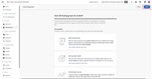

# [!DNL Journey Optimizer B2B Edition] Tutoriales

Descubra cómo sacar el máximo partido a [!DNL Journey Optimizer B2B Edition]. Orqueste los recorridos de la cuenta y del grupo de compras mediante la IA generativa integrada y la automatización líder del sector para maximizar la demanda de ofertas específicas.

## Novedades {#whats-new}

* [Presentando Recorridos de cuenta](/help/account-journeys/introducing-account-journeys.md)
  _Conozca todos los Recorridos de la cuenta y cómo usarlos para atraer a su audiencia objetivo._

* [Crear un Recorrido de cuenta](/help/account-journeys/create-an-account-journey.md)
  _Aprenda a utilizar la audiencia de la cuenta, el nodo de acción, el nodo de escucha y el nodo de rutas divididas para crear Recorridos de cuenta._

* [Nodo de acción](/help/account-journeys/journey-nodes/action-node.md)
  _Obtenga información acerca de los nodos de acción y cómo configurarlos al crear un Recorrido de cuentas._

* [Nodo de escucha](/help/account-journeys/journey-nodes/listen-node.md)
  _Obtenga información acerca de los nodos de escucha y cómo configurarlos al crear un Recorrido de cuentas._

* [Recorrido de la cuenta dividida](/help/account-journeys/journey-nodes/split-account-journey.md)
  _Obtenga información acerca de los nodos de ruta de acceso de división o combinación y cómo configurarlos al crear un Recorrido de cuentas._

## Vídeos más populares {#most-popular-videos}

<table>
<tr>
<td>

<a href="/help/buying-groups/buying-groups-overview.md"><strong>Resumen de grupos de compra</strong></a>

</td>
<td>

<a href="/help/buying-groups/create-a-buying-group.md"><strong>Crear un grupo de compra</strong></a>

</td>
<td>

<a href="/help/buying-groups/role-templates.md"><strong>Plantillas de roles</strong></a>

</td>
</tr>
</table>
